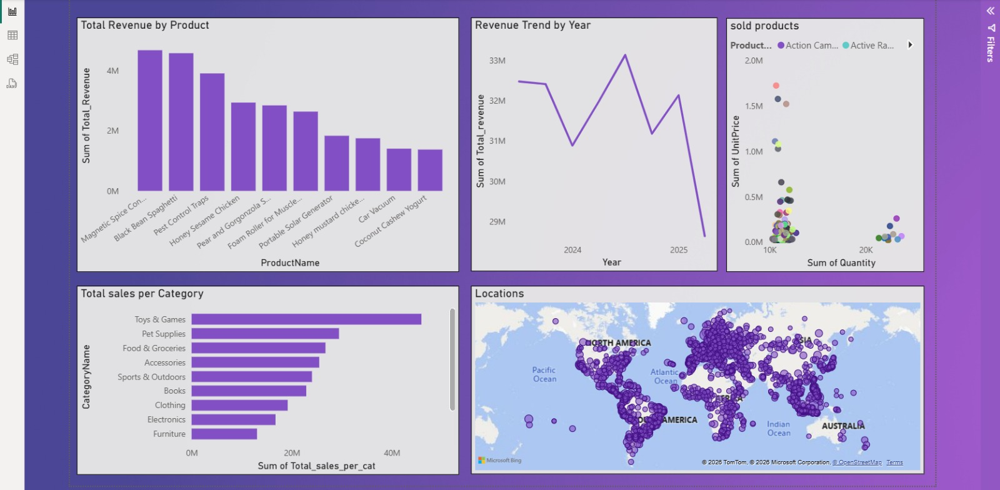

# SQL Data Analysis Project

👉 This dashboard visualizes key insights extracted using SQL queries.
## 🔗 Live Dashboard
https://dashboardneo-c7unui0o3xi.streamlit.app/

## 📌 Project Overview
This project analyzes business data to extract insights and support data-driven decision-making.  
It was completed as part of the GDG Data Analysis Track.

## 🛠 Tools & Technologies
- MySQL
- SQL (Joins, Subqueries, Aggregations)
- Power BI / Interactive Dashboard
- Data Cleaning & Transformation

## 📊 Key Analysis Performed
- Analyzed sales performance and business trends  
- Identified top-performing products and key revenue drivers  
- Explored customer behavior patterns  
- Extracted actionable insights to support decision-making  

## 🧠 SQL Concepts Applied
- Joins (INNER, LEFT)  
- Aggregations (SUM, AVG, COUNT)  
- Subqueries  
- GROUP BY & HAVING  
- Data manipulation (INSERT, UPDATE)  

## 📁 Project Deliverables
- SQL queries and analysis scripts  
- Interactive dashboard for data visualization  
- PowerPoint presentation summarizing insights  

## 🚀 Key Outcomes
- Improved understanding of sales trends and performance  
- Identified patterns in customer behavior  
- Demonstrated ability to analyze and transform structured data  

## 👤 Author
Omar Fayez
